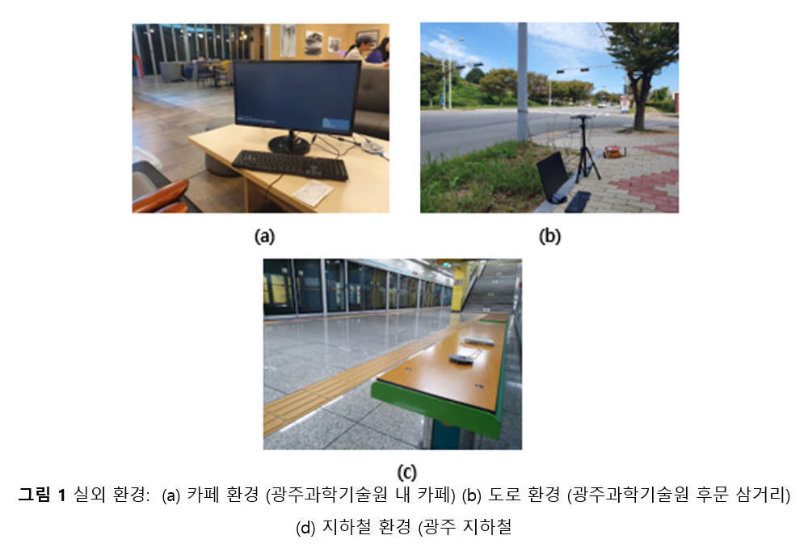
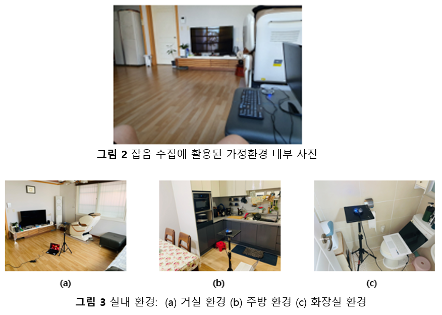

# 다채널 마이크 어레이를 활용한 환경 잡음 데이터베이스
## 개요
* 본 데이터셋 공개 레포지터리는 실 환경에서의 응용서비스 특히 음성과 관련한 서비스를 위한 환경잡음 감쇄 관련 연구 및 개발을 위한 환경 잡음 데이터 베이스에 대해 상세 기술하고 이를 배포한다.
## DB 상세 내용
* 실내외 환경에서 다채널 마이크 어레이를 사용하여 환경잡음 데이터 수집
* 3가지 실외 잡음환경 (카페 환경,	도로 환경, 지하철 환경) 및 실내 잡음환경 (가정집) 에서 잡음 데이터를 수집
* 실외 잡음환경

* 실내 잡음환경

* 사용 마이크 어레이 
* * ReSpeaker Core v2.0
* * UMA-8 USB mic array V2.0
## 잡음 데이터 규격 
* 실외 환경
|Noisy class              |Number of Files Average | RMS Power (dB) |	Total Length(sec)|
|----------------|-------------------------|-------------------------|-------------------------|
|Caffe	Bell	    |43|	-26	| 657
|Caffe	Music	    |93|	-26	| 4,407
|Caffe	Bowl	    |47|	-25	| 852
|Caffe	Machine	    |22|	-29	| 473
|Caffe	Mix	        |15|  -24	| 1,186
|Street	Car	        |64|  -19	| 8,328
|Street	load	    |35|	-29	| 917
|Street	Wind	    |19|	-21	| 521
|Subway	Music	    |43|	-33	| 1,487
|Subway	Train-Stop	|93|	-18	| 1,017
|Subway	Train-In	|47|	-15	| 3,500
|Subway	Station	    |22|	-33	| 2,035
* 실내 환경
|Noisy class              |Number of Files Average | RMS Power (dB) |	Total Length(sec)|
|----------------|-------------------------|-------------------------|-------------------------|
|Living Room	TV	        |210	|60	    |2,100|
|Living	Air conditioner	|246	|45	    |2,460|
|Living	Vacuum cleaner	|219	|75	    |2,190|
|Kitchen	Kitchen Hood	|216	|53	    |2,160|
|Kitchen	Cutting Board	|192	|65	    |1,920|
|Kitchen	Cooking	        |217	|60~70	|2,170|
|Bathroom	Wash basin	|225	|58	    |2,250|
|Bathroom	Shower	    |236	|60	    |2,360|
|Bathroom	Toilet	    |96	    |65	    |960  |

* Please contact the lableader of AiTeR lab (aiter.gist.ac.kr) for FULL dataset.

## Acknowledgement
This work was supported in part by the Institute for Information & communications Technology Promotion (IITP) grant funded by the Korea government (MSIT) (2017-0-00255, Autonomous digital companion framework and application)
